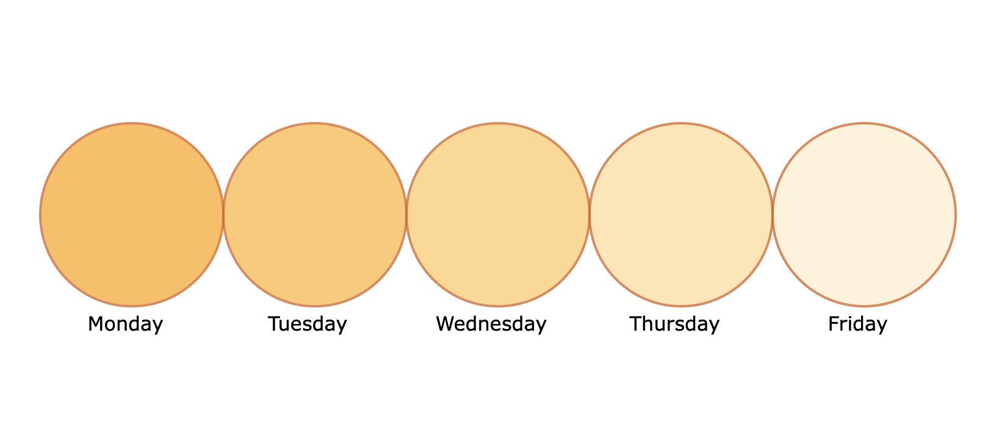

## D3 HW2

Here is my output of the D3 Homework 2 using SVG and D3 template. I decided to make a chart that used a deeper color to show how many coffees I have based on the day of the week. I used very simple values to measure and used circles. There were several points i needed extra help on and used some external sources i linked below to make the code work. I struggled to make the shapes smaller in the html file, but ultimately got the basics of how to use these values and template to create a visualization. 

External sources i used were: [Link to first additional source](https://developer.mozilla.org/en-US/docs/Web/SVG/Tutorials/SVG_from_scratch/Basic_shapes)
[Link to second additional source](https://www.w3schools.com/cssref/css_websafe_fonts.php)
[Link to third additional source](https://stackoverflow.com/questions/5737975/circle-drawing-with-svgs-arc-path)
