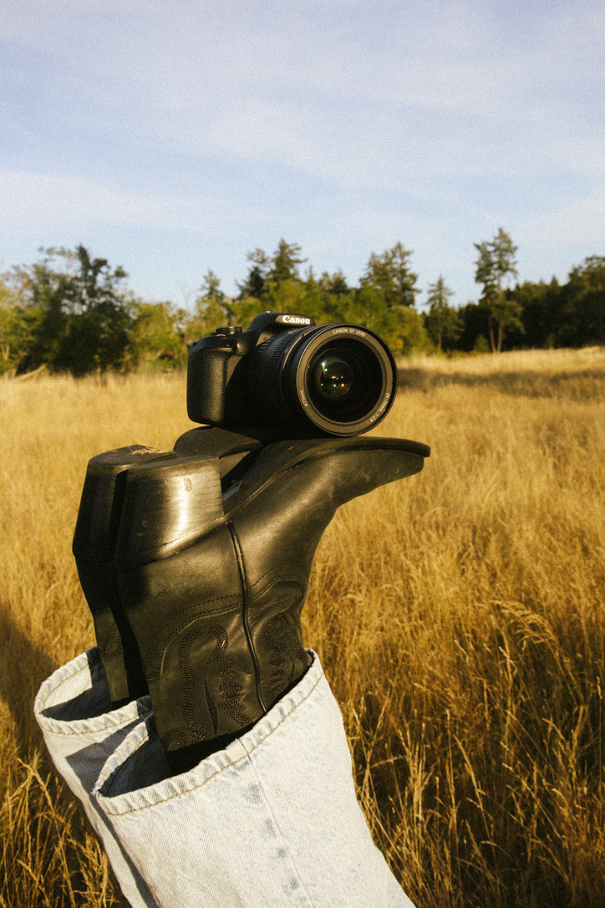

## Welcome

Hey there! 

My name is Alli Nemec and I am a senior at the University of Washington. I am currently double majoring in Mathematical Thinking & Visualization and Media & Communication Studies. I am also double minoring in Informatics and Visual & Media Arts. I have coding experience with several programming languages such as R, Java and Python. My design experience started with my passion in photography allowing me to gain skills in adobe suite and Canva and led to my visual design skills in tableau and R. I hope to pursue UX/UI design after college with a hope to focus on companies within media or the music industry. 

  

