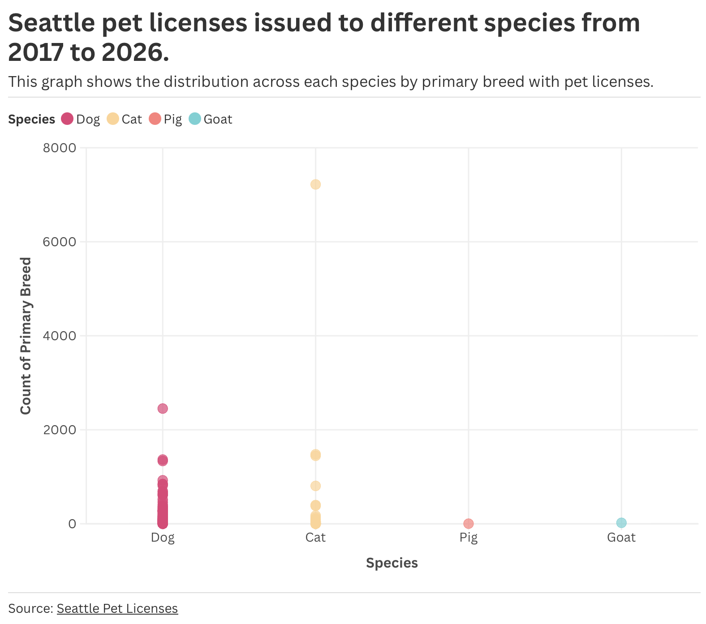

## Seattle Pet Licenses - All Species  

The graph I decided to explore was the same dataset from my first Flourish assignment on Seattle Pet Licenses issued in the city of Seattle, WA. For this dataset, instead of focusing on just one specific species which I had chosen to highlight dogs, all four species recorded are featured in this graph. This assignment we were supposed to show what the dataset can or cannot show well in a visualization. This graph is easy to comprehend, however it is hard to read since the breeds are so close in count and there are a huge amount of them which makes the visualization tight and needing the hover tool in flourish to see each point. 

[Link to Flourish visualization](https://public.flourish.studio/visualisation/28639697/)

