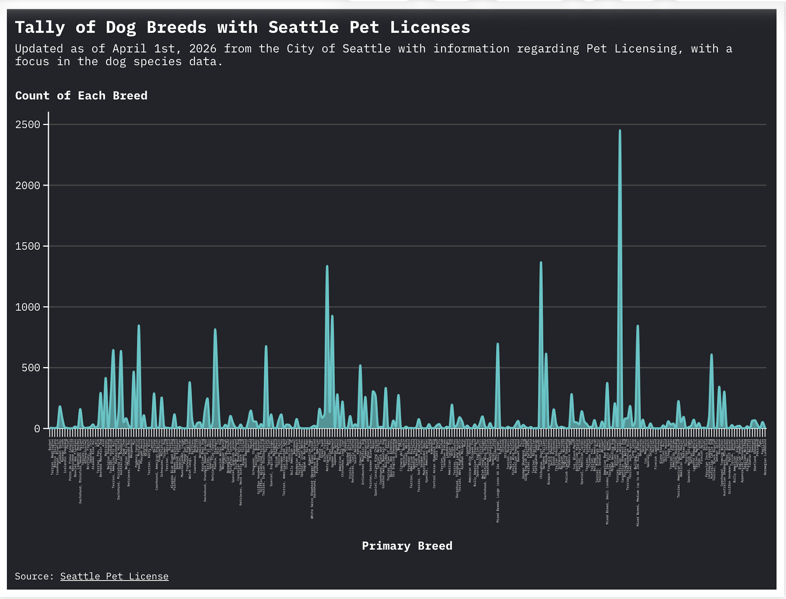

## Flourish HW 1

Using data sourced from data.seattle.gov, I wanted to look at Seattle pet licensing but specifically for the dog species and the count distribution across all the different breeds found in the city of Seattle.

[Link to Flourish Visualization] (https://public.flourish.studio/visualisation/28546826/)

