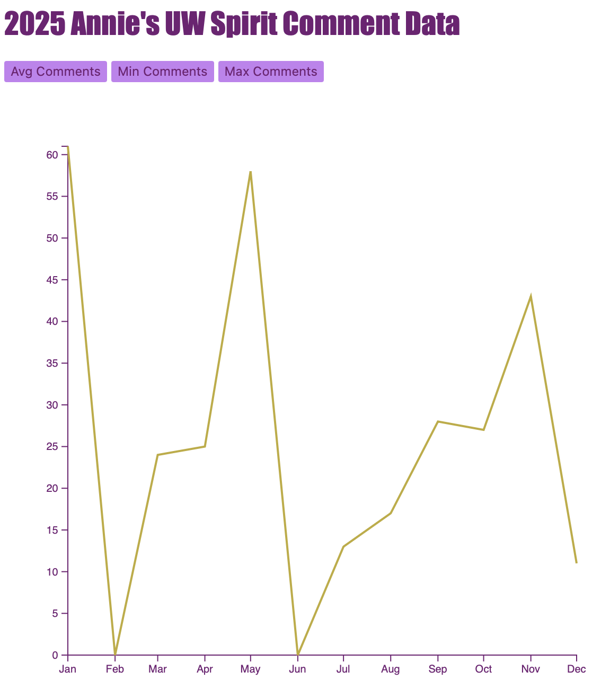
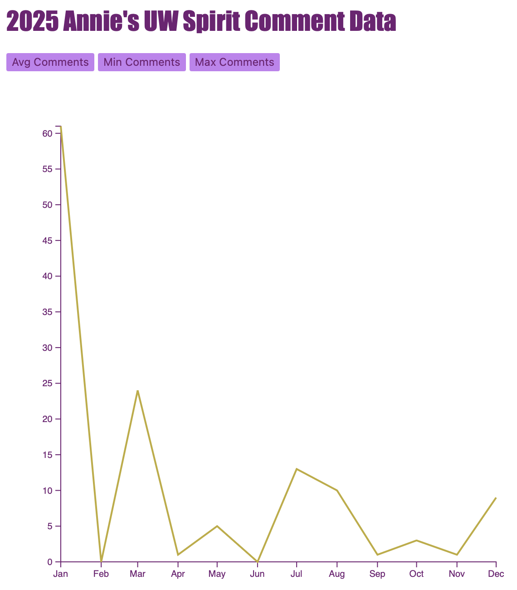
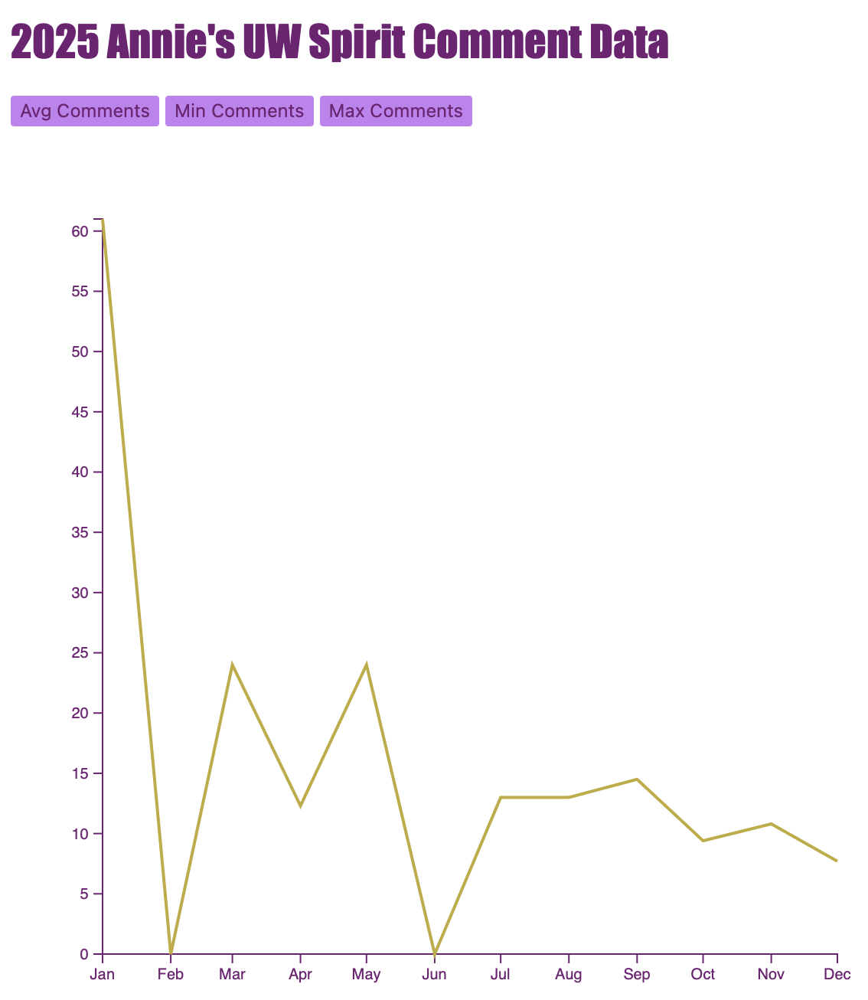

## D3 HW3

Here is my output of the D3 Homework 3 using SVG and D3 templates linked in our assignment for week 8. I decided to work on the line chart with transitions and multiple tabs to look at the maximum and average. I decided to highlight my roommates social media page as she has a lot of easy data numbers and multiple posts in each month that I can analyze the comment statistics on based on the year from 2025 allowing us to see how she blew up on social media over the year, which thus gained more traction to her page. I sourced the data from her instagram page [here](https://www.instagram.com/uwspirit_anniez/) and used the data to make the chart myself in a csv file.

